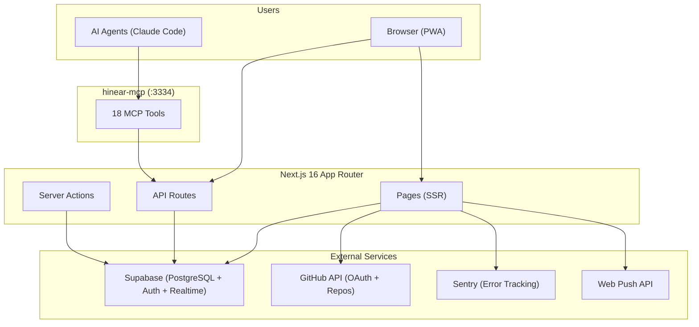
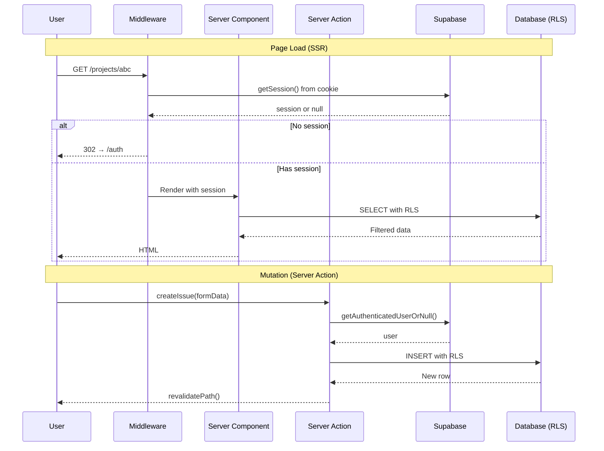
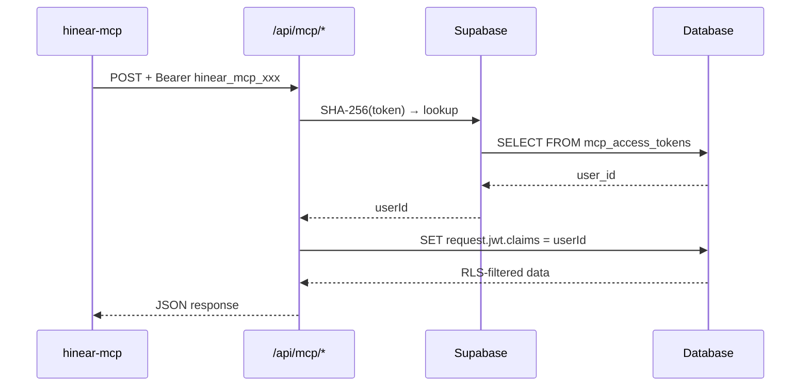
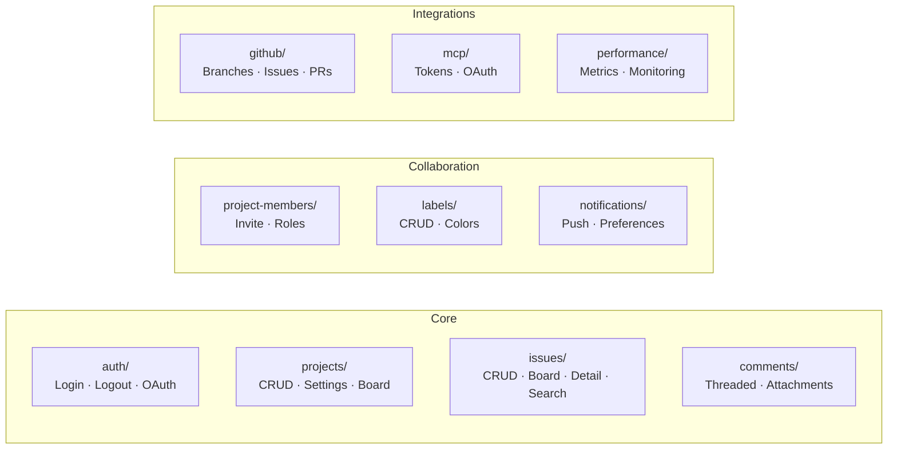
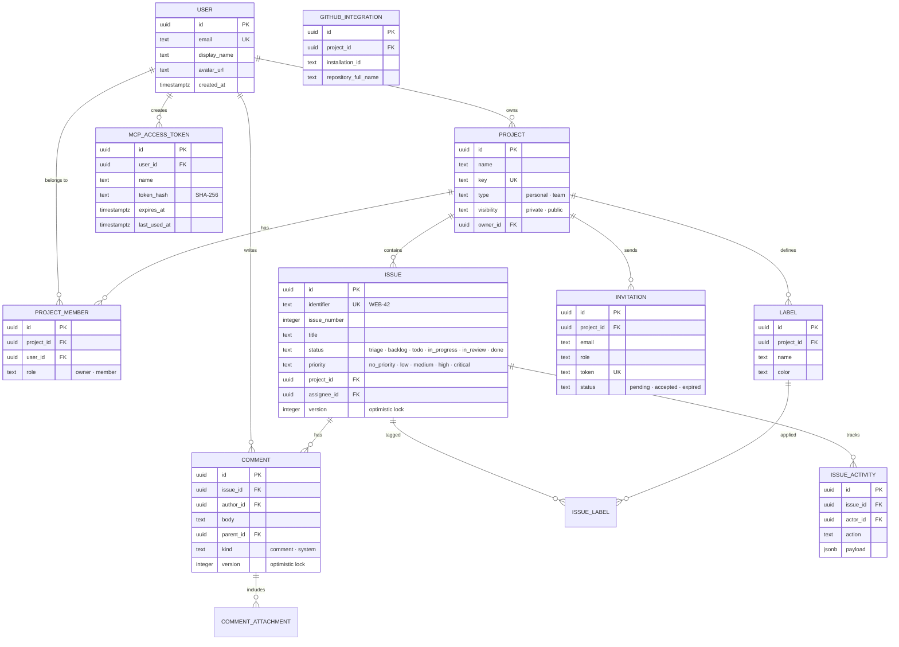
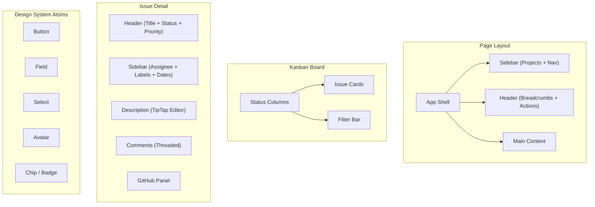
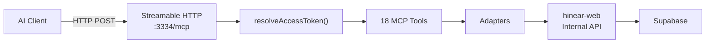

# Hinear Architecture Documentation

> Generated: 2026-04-06

## Table of Contents

1. [System Overview](#1-system-overview)
2. [Project Structure](#2-project-structure)
3. [Authentication](#3-authentication)
4. [Feature Modules](#4-feature-modules)
5. [API Reference](#5-api-reference)
6. [Database Schema](#6-database-schema)
7. [Component Architecture](#7-component-architecture)
8. [State Management](#8-state-management)
9. [External Integrations](#9-external-integrations)
10. [PWA & Offline](#10-pwa--offline)
11. [MCP Server](#11-mcp-server)

---

## 1. System Overview



### Tech Stack

| Layer | Technology |
|---|---|
| Framework | Next.js 16.2.0 (App Router) |
| Language | TypeScript 5.x |
| Database | Supabase PostgreSQL + RLS |
| Auth | Supabase Auth + GitHub OAuth |
| State | @tanstack/react-query 5 |
| Styling | Tailwind CSS v4 |
| Rich Text | TipTap |
| Animations | Framer Motion |
| PWA | next-pwa + Service Worker |
| Testing | Vitest + Testing Library + Playwright |
| Linting | Biome |
| Error Tracking | Sentry |
| MCP Protocol | @modelcontextprotocol/sdk |

---

## 2. Project Structure

```
hinear/
├── hinear-web/                    # Next.js web application
│   ├── src/
│   │   ├── app/                   # App Router (pages + API routes)
│   │   ├── components/            # Reusable UI (atoms/molecules/organisms)
│   │   ├── features/              # Feature modules (domain logic)
│   │   ├── lib/                   # Core libraries and utilities
│   │   ├── mocks/                 # Mock data for development
│   │   ├── stories/               # Storybook stories
│   │   ├── test/                  # Test utilities and setup
│   │   └── worker/                # Service worker (push notifications)
│   ├── public/                    # Static assets
│   ├── supabase/                  # Database migrations
│   └── docs/                      # Documentation
│
├── hinear-mcp/                    # Standalone MCP server
│   ├── src/
│   │   ├── tools/                 # 18 MCP tool implementations
│   │   ├── adapters/              # Data access layer
│   │   ├── schemas/               # Zod validation schemas
│   │   └── lib/                   # Core utilities
│   └── docs/
│
└── hinear-harness/                # GitHub webhook bridge (TS temp, Go planned)
    └── src/
```

### App Router Pages

| Route | Description |
|---|---|
| `/` | Home / Landing |
| `/auth` | Login / Signup |
| `/projects` | All projects dashboard |
| `/projects/new` | Create project |
| `/projects/:id` | Project kanban board |
| `/projects/:id/issues/:issueId` | Issue detail |
| `/projects/:id/overview` | Project overview |
| `/projects/:id/settings` | Project settings |
| `/projects/profile` | User profile |
| `/settings/mcp` | MCP token management |
| `/invite/:token/accept` | Accept invitation |
| `/~offline` | Offline fallback page |

---

## 3. Authentication



### Auth Methods

| Method | Use Case | How |
|---|---|---|
| **Supabase Session** | Web browser users | Cookie-based, auto-refresh |
| **GitHub OAuth** | Web login | `/api/github/auth` → callback |
| **MCP Access Token** | AI agents | `hinear_mcp_*` prefix, hashed in DB |
| **Service Role Key** | Internal services | Bypasses RLS, server-only |

### MCP Token Auth Flow



---

## 4. Feature Modules

Each feature follows the same internal structure:

```
src/features/[feature-name]/
├── actions/          # Server Actions (mutations)
├── components/       # Feature-specific React components
├── hooks/            # React Query hooks
├── lib/              # Business logic
├── presenters/       # View model transformations
├── repositories/     # Data access layer
├── types/            # TypeScript types
└── contracts.ts      # Input/output type definitions
```

### Feature Map



| Feature | Key Components | Server Actions |
|---|---|---|
| auth | AuthForm, ProfileSettingsScreen | login, logout |
| projects | CreateProjectSection, ProjectSettingsCard | create, update, delete |
| issues | BoardIssueCard, CreateIssueSection, IssueDetailDrawer | create, update, search, batch |
| comments | CommentList, CommentInput, MarkdownEditor | create, update, delete |
| project-members | MemberList, InviteMemberCard | invite, updateRole, remove |
| labels | LabelManager | create, update, delete |
| notifications | NotificationPreferences | subscribe, unsubscribe |
| github | GitHubIntegrationSection | connect, sync |
| mcp | McpTokenSettingsCard, McpConnectSidebarAction | createToken, revoke |
| performance | PerformanceReport | report |

---

## 5. API Reference

### RESTful API v1 (`/api/v1/`)

| Method | Endpoint | Description |
|---|---|---|
| GET | `/v1/projects/:id/issues` | List project issues |
| POST | `/v1/projects/:id/issues` | Create issue |
| GET | `/v1/issues/:issueId` | Get issue detail |
| PATCH | `/v1/issues/:issueId` | Update issue |
| DELETE | `/v1/issues/:issueId` | Delete issue |
| GET | `/v1/projects/:id/members` | List project members |
| PATCH | `/v1/members/:memberId` | Update member role |
| DELETE | `/v1/members/:memberId` | Remove member |

### Internal API Routes

| Prefix | Routes | Description |
|---|---|---|
| `/api/auth/` | logout | Session management |
| `/api/github/` | auth, callback, repositories | GitHub OAuth + data |
| `/api/issues/` | CRUD, search, batch, comments, attachments | Issue management |
| `/api/projects/` | CRUD, members, github | Project management |
| `/api/mcp/` | oauth/*, tokens/* | MCP token lifecycle |
| `/api/notifications/` | subscribe, unsubscribe, preferences, send | Push notifications |
| `/api/performance/` | metrics, baselines, report | Performance monitoring |
| `/api/members/` | check-access | Access control |
| `/api/users/` | :id, :id/projects | User data |

---

## 6. Database Schema



### Key RLS Policies

- Users can only see projects they are members of
- Only project owners can manage members and settings
- Issue visibility follows project membership
- MCP tokens are scoped to individual users
- Service role bypasses RLS for internal operations

---

## 7. Component Architecture



### Component Layers

| Layer | Description | Examples |
|---|---|---|
| **Atoms** | Primitive UI elements | Button, Field, Select, Avatar, Chip |
| **Molecules** | Composed from atoms | HeaderAction, ProjectSelect, ConflictDialog |
| **Organisms** | Complex standalone components | BoardIssueCard, CreateProjectSection, MarkdownEditor |
| **Features** | Domain-specific compositions | IssueDetailDrawer, McpTokenSettingsCard |

---

## 8. State Management

### React Query Configuration

| Data Type | Stale Time | GC Time | Refetch |
|---|---|---|---|
| Projects | 10 min | 10 min | On focus: off |
| Issues | 5 min | 10 min | On focus: off |
| Comments | 1 min | 10 min | On focus: off |
| Labels | 5 min | 10 min | On focus: off |
| Members | 5 min | 10 min | On focus: off |

### Optimistic Updates

- Issue status changes (drag & drop on board)
- Comment creation
- Member role changes

### Optimistic Locking

- Issues and Comments use a `version` field
- Conflict detection on concurrent edits
- `ConflictDialog` component for resolution

---

## 9. External Integrations

### Supabase

- **Auth**: Email/password + GitHub OAuth
- **Database**: PostgreSQL with RLS policies
- **Realtime**: Used for notification subscriptions
- **Storage**: File attachments for comments

### GitHub

- OAuth login via `/api/github/auth`
- Repository listing for project linking
- Branch creation from issues
- Issue/PR linking and synchronization

### Sentry

- Client-side error capture
- Server-side error capture via Pino integration
- Performance transaction tracking (optional)

### Push Notifications

- Web Push API with VAPID keys
- Service worker for background processing
- Per-project notification preferences
- Click-to-open routing via notification data

---

## 10. PWA & Offline

| Feature | Implementation |
|---|---|
| Service Worker | `src/worker/index.js` — auto-update with skipWaiting |
| Manifest | Dynamic icon generation via `/api/pwa/icon` |
| Offline Page | `/~offline` — shown when no connectivity |
| Push | Background push via service worker |
| Install | PWA install prompt on supported browsers |

---

## 11. MCP Server

The standalone MCP server at `hinear-mcp/` provides 18 tools for AI agents.

### Architecture



### Tool Categories

| Phase | Tools | Count |
|---|---|---|
| Core | list_projects, search_issues, get_issue_detail, create_issue, update_issue_status, add_comment | 6 |
| Labels | list_labels, create_label, update_label, delete_label | 4 |
| Batch | batch_update_issues | 1 |
| Members | list_members, invite_member, update_member_role, remove_member | 4 |
| GitHub | create_github_branch, link_github_issue, link_github_pr | 3 |

### Quick Connect (for users)

```bash
claude mcp add hinear https://mcp.hinear.dev/api/mcp
```

Opens browser for sign-in automatically via OAuth discovery.

### Token-based (fallback)

Generate token at `/settings/mcp`, then:

```bash
claude mcp add --transport http hinear https://hinear.dev/api/mcp \
  --header "Authorization: Bearer hinear_mcp_xxx"
```
